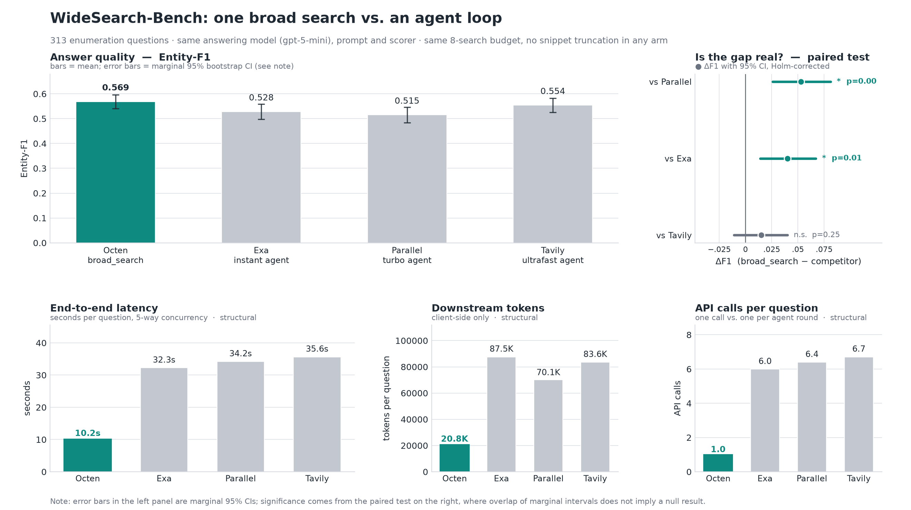

# WideSearch-Bench

313 English and Chinese questions for evaluating multi-entity web search, with reference answers dated **2026-09-18**.

## Dataset

- [Pooled reference answers](data/tasks.jsonl) · [Strict reference answers](data/tasks_strict.jsonl)
- [Dataset description](data/DATASHEET.md) · [Statistics](data/DATASET_STATS.md)
- [Per-question results](results/cases.jsonl) · [Run records](results/grades.jsonl)

## Evaluation

Every configuration uses the same questions, answering model (`gpt-5-mini`, low reasoning effort), shared evidence-grounding rules and Entity-F1 scorer. Entity identities and aliases are shared across configurations. Results include both reference sets and all six pairwise comparisons, with Holm correction; configurations appear alphabetically with equal visual emphasis.

Octen uses broad_search followed by a reader; Exa, Parallel and Tavily use search-agent loops. The configured limit is eight subqueries/search actions with five retained results each. Backends, excerpts and answering workflows differ. See [configuration and measurement details](data/PROVENANCE.md).

## Results

<!-- BEGIN GENERATED -->
Pooled references:

| Configuration | F1 | Precision | Recall | API calls | Searches | Tokens | E2E (s) | Source domains |
|---|---:|---:|---:|---:|---:|---:|---:|---:|
| Exa-instant | 0.4835 | 0.4726 | 0.5484 | 6.05 | 6.05 | 88,031 | 32.47 | 15.34 |
| Octen broad_search | 0.5428 | 0.5709 | 0.5849 | 1.00 | 7.98 | 20,911 | 10.20 | 22.73 |
| Parallel-turbo | 0.4632 | 0.4620 | 0.5204 | 6.46 | 6.46 | 70,511 | 34.39 | 13.21 |
| Tavily-ultrafast | 0.4920 | 0.5039 | 0.5316 | 6.72 | 6.72 | 83,552 | 35.63 | 17.26 |

<details>
<summary>Strict reference scores</summary>

| Configuration | F1 | Precision | Recall |
|---|---:|---:|---:|
| Exa-instant | 0.4542 | 0.4218 | 0.5507 |
| Octen broad_search | 0.5342 | 0.5352 | 0.6124 |
| Parallel-turbo | 0.4361 | 0.4130 | 0.5250 |
| Tavily-ultrafast | 0.4655 | 0.4537 | 0.5336 |

</details>

On this dataset, Octen broad_search has the highest mean Entity-F1 against both reference sets and the lowest recorded mean latency and downstream-token usage.

Quality metrics average all 313 tasks; other columns average completed runs. API calls count logical retrieval invocations; searches count recorded subqueries/search actions. Tokens are recorded downstream LLM usage; source domains count distinct retrieved domains per run.
<!-- END GENERATED -->



[All pairwise comparisons](results/PAIRED_STATS.md) · [Machine-readable summary](results/summary.json)

## Reproduce

Python 3.10 or newer. Install dependencies and fill in the keys in `.env`:

```sh
pip install -e '.[analysis]'
cp .env.example .env
set -a; source .env; set +a
widesearch run data/tasks.jsonl --out my-run \
  --arms exa-instant-agent,octen-broad-search,parallel-turbo-agent,tavily-ultrafast-agent \
  --repeats 1 --concurrency 5
```

Re-score the published answers without API calls:

```sh
python tools/regrade.py --grades results/grades.jsonl \
  --gold data/tasks.jsonl --out /tmp/pooled.jsonl
python tools/regrade.py --grades results/grades.jsonl \
  --gold data/tasks_strict.jsonl --out /tmp/strict.jsonl
python tools/release_report.py --check
```

## Citation and license

[MIT](LICENSE). Cite [WideSearch-Bench 2026.09](CITATION.cff) and the commit used.
